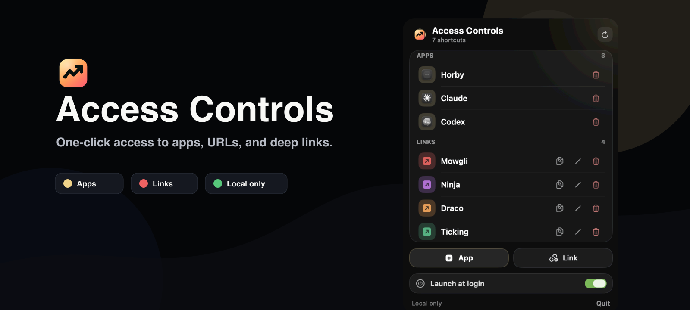
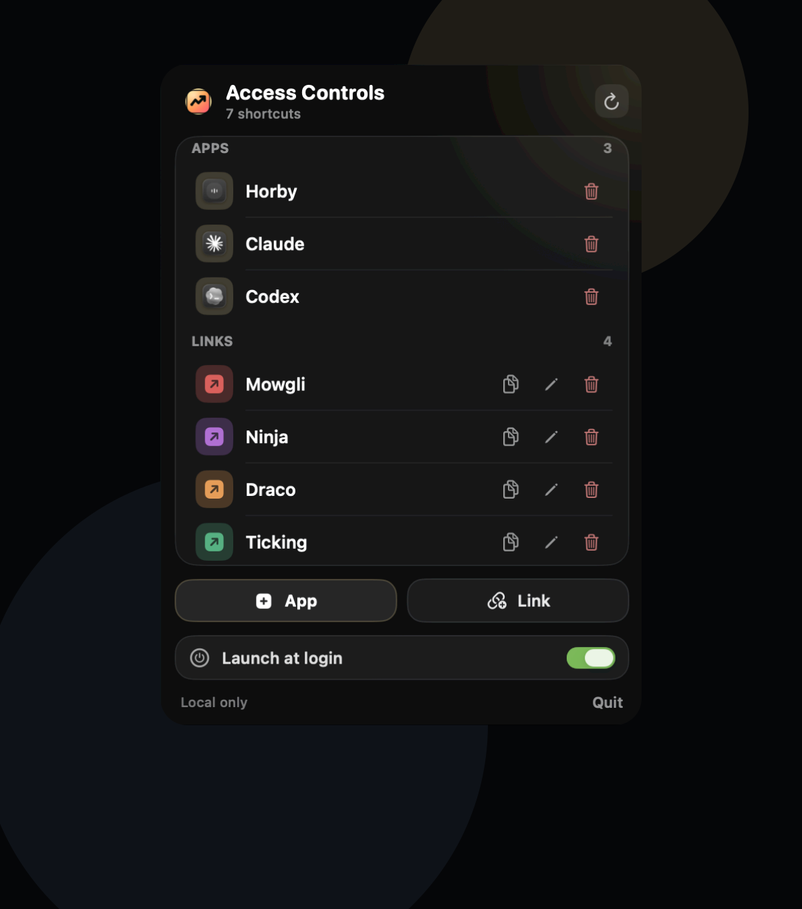

# Access Controls

A native macOS menu bar app for one-click access to saved applications and URLs/deep links.

<p align="center">
  
</p>

## Preview

<p align="center">
  
</p>

## Features

- Add macOS apps from a compact standalone picker; app shortcuts use the system app name and icon.
- Add URLs and custom deep links such as `schoolapp://campus/42` from a standalone editor window.
- Give links a label, optional description, and color.
- Click an app item to bring it forward if it is already running, or launch it if it is closed.
- Click a link item to open it with macOS, using the default browser or the app registered for that URL scheme.
- Edit or delete saved links, and delete saved apps.
- Optional Launch at Login toggle.

Saved items are stored locally at:

`~/Library/Application Support/AccessControls/items.json`

## Build

```bash
swift run AccessControlsCoreChecks
Scripts/build-app.sh
open build/AccessControls.app
```

The app is packaged as a menu bar-only app using `LSUIElement`, so it does not show a Dock icon.

## Release Bundle

The repository includes a GitHub Actions release workflow that builds the app bundle, zips `AccessControls.app`, generates a SHA-256 checksum, and attaches both files to a GitHub Release.

Run it manually from GitHub Actions with a tag such as `v1.0.0`, or publish by pushing a release tag:

```bash
git tag v1.0.0
git push origin v1.0.0
```

## License

Access Controls is open source under the MIT License.
